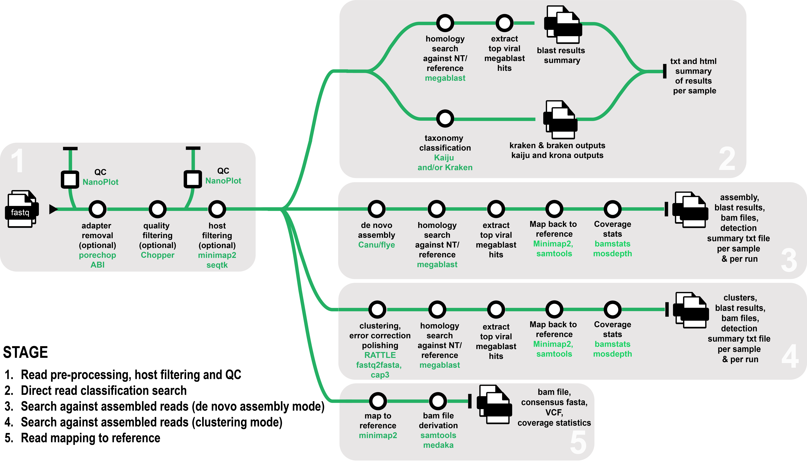

## About this guide
This is a guide outlining how to set up and execute [the ONTViSc pipeline](https://github.com/eresearchqut/ONTViSc) on three high-performance computing systems hosted by Australian research and computing facilities: [Lyra (Queensland University of Technology)](https://eresearchqut.atlassian.net/wiki/spaces/EG/pages/1545143157/Start+using+the+HPC), [Gadi (National Computational Infrastructure)](https://opus.nci.org.au/display/Help/Gadi+User+Guide) and [Setonix (Pawsey)](https://support.pawsey.org.au/documentation/display/US/Setonix+User+Guide). Throughout this guide we will make use of the Australian Nextflow Seqera Service provided to the researchers by [Australian BioCommons](https://www.biocommons.org.au/). 

## ONTViSc (ONT-based Viral Screening for Biosecurity)
ONTViSc is a Nextflow-based bioinformatics pipeline designed to help diagnostics of viruses and viroid pathogens for biosecurity. It takes fastq files generated from either amplicon or whole-genome sequencing using Oxford Nanopore Technologies as input. The pipeline can either: 1) perform a direct search on the sequenced reads, 2) generate clusters, 3) assemble the reads to generate longer contigs or 4) directly map reads to a known reference. The reads can optionally be filtered from a plant host before performing downstream analysis.

## Acknowledgements

This guide makes use of the [ELIXIR toolkit theme](https://github.com/ELIXIR-Belgium/elixir-toolkit-theme)


 
Thank you to Sarah Beecroft (Pawsey), Matthew Downton (Gadi) and Ziad Al-Bkhetan (Australian BioCommons) for help with testing the pipeline on Gadi and Setonix, as well as for providing valuable information regarding these two high-performance computing environments. Thank you also to the eResearch team from QUT for making it possible to execute the ONTViSc pipeline on Lyra and for all the provided support.
